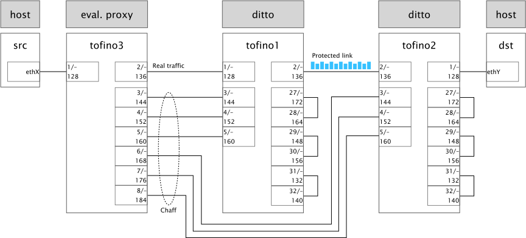

# ditto: WAN Traffic Obfuscation at Line Rate

This repository contains the prototype implementation of ditto as described in the NDSS 2022 paper by Roland Meier, Vincent Lenders and Laurent Vanbever (available [here](https://nsg.ee.ethz.ch/fileadmin/user_upload/publications/ditto_final_ndss22.pdf)).

For questions or comments, please contact Roland Meier (meierrol/at/ethz/dot/ch)

Citation:
```
@inproceedings{meier2022ditto,
title={ditto: WAN Traffic Obfuscation at Line Rate},
author={Meier, Roland and Lenders, Vincent and Vanbever, Laurent},
booktitle={NDSS Symposium 2022},
year={2022},
organization={Internet Society}
}
```


## Abstract
Many large organizations operate dedicated wide area networks (WANs) distinct from the Internet to connect their data centers and remote sites through high-throughput links. While encryption generally protects these WANs well against content eavesdropping, they remain vulnerable to traffic analysis attacks that infer visited websites, watched videos or contents of VoIP calls from analysis of the traffic volume, packet sizes or timing information. Existing techniques to obfuscate Internet traffic are not well suited for WANs as they are either highly inefficient or require modifications to the communication protocols used by end hosts.

This paper presents ditto, a traffic obfuscation system adapted to the requirements of WANs: achieving high-throughput traffic obfuscation at line rate without modifications of end hosts. ditto adds padding to packets and introduces chaff packets to make the resulting obfuscated traffic independent of production traffic with respect to packet sizes, timing and traffic volume.

We evaluate a full implementation of ditto running on programmable switches in the network data plane. Our results show that ditto runs at 100 Gbps line rate and performs with negligible performance overhead up to a realistic traffic load of 70 Gbps per WAN link.


## Repository overview

The most important contents of this repository are:

* `python/p4_code_generator`: Python script to generate parts of the P4 code automatically (for a given pattern, topology etc.)
* `p4/traffic_pattern_tofino`: P4 code to run ditto on Tofino switches. Parts of this code are generated automatically (see below).
* `p4/evaluation_proxy_tofino`: P4 code for an "evaluation proxy" switch. This switch distributes chaff packets and (if configured) adds an evaluation header to perform measurements.
* `labsetup_public`: information about the switches (ports, cables). This is used for the code generator.


## Running ditto (prepared example)

The code in the repository assumes a topology consisting of three Intel Tofino switches as shown below. All switches need to run SDE 8.9.
* The pattern is `[533, 1066, 1600]`
* `tofino1` and `tofino2` are running ditto to protect the traffic on the link between them
* `tofino3` helps to distribute chaff packets and can add additional headers (e.g., with timestamps) to perform measurements



### Configure `tofino1`
1. Compile ditto: 
```bash
sudo ~/tools/p4_build.sh ~/ditto/p4/traffic_pattern_tofino/p4src/traffic_pattern_tofino.p4 --with-tofino
```

2. Run ditto: 
```bash
$SDE/run_switchd.sh -p traffic_pattern_tofino
```

3. Add table entries: 
```bash
$SDE/run_bfshell.sh -f ~/ditto/p4/traffic_pattern_tofino/bfshell_input_tofino1.txt
```

4. Configure queues: 
```bash
~/tools/run_pd_rpc.py -p evaluation_proxy_tofino ~/ditto/p4/traffic_pattern_tofino/init_pd_rpc.py
```


### Configure `tofino2`
1. Compile ditto: 
```bash
sudo ~/tools/p4_build.sh ~/ditto/p4/traffic_pattern_tofino/p4src/traffic_pattern_tofino.p4 --with-tofino
```

2. Run ditto: 
```bash
$SDE/run_switchd.sh -p traffic_pattern_tofino
```

3. Add table entries: 
```bash
$SDE/run_bfshell.sh -f ~/ditto/p4/traffic_pattern_tofino/bfshell_input_tofino2.txt
```

4. Configure queues: 
```bash
~/tools/run_pd_rpc.py -p traffic_pattern_tofino ~/ditto/p4/traffic_pattern_tofino/init_pd_rpc.py
```


### Configure `tofino3`
1. Compile ditto: 
```bash
sudo ~/tools/p4_build.sh ~/ditto/p4/evaluation_proxy_tofino/evaluation_proxy_tofino.p4 --with-tofino
```

2. Run ditto: 
```bash
$SDE/run_switchd.sh -p evaluation_proxy_tofino
```

3. Add table entries: 
```bash
$SDE/run_bfshell.sh -f ~/ditto/p4/evaluation_proxy_tofino/bfshell_input_tofino3.txt
```

4. Configure queues: 
```bash
~/tools/run_pd_rpc.py -p evaluation_proxy_tofino ~/ditto/p4/evaluation_proxy_tofino/init_pd_rpc.py
```


### Inject chaff packets
Inject packets from the `src` server in the figure above:

```bash
sudo python python/send_packets/inject_chaff_packets.py --interface $INTERFACE -vv 
```


### Send real packets

Now you can send traffic from `src` to `dst` and vice-versa. Note that ditto only forwards IPv4 packets at the moment.

## Running ditto (custom setting)

By editing the `main` function in `python/p4_code_generator/generate_code.py`, it is possible to generate ditto code for other environments (e.g., using a different topology) or with other parameters (e.g., a different pattern).

To run `generate_code.py`, we suggest to create a virtual environment, install the requirements from `requirements.txt` and run the script
```
python generate_code.py
```

This will automatically generate the following files in `p4/traffic_pattern_tofino/` (note that the existing files are replaced):

* `p4src/include/generated/add_padding.p4`: The P4 code (which is included in the main program `traffic_pattern_tofino.p4`).
* `bfshell_input_X.txt`: input files for `bfshell` (table entries etc.). There is one file for each switch (`X` is the switch name).
* `pd_rpc_info_X.json`: configuration files for `pd_rpc` (queues, mirroring sessions etc.). There is one file for each switch (`X` is the switch name).